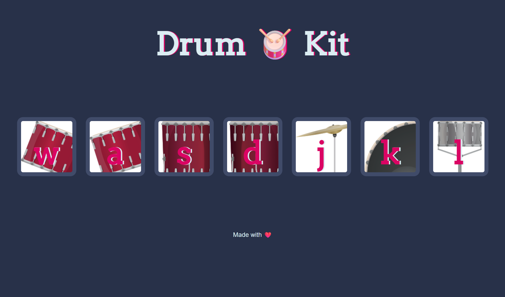

# 🥁 Drum Kit 🥁

A fun, interactive **Drum Kit** web app built with HTML, CSS, and JavaScript.  
Play different drum sounds by clicking the drum icons or pressing the corresponding keys on your keyboard.  
Perfect for unleashing your inner drummer—no sticks required! 🎶

🌐 **Live Demo**: [Play the Drum Kit](https://catheringino.github.io/DrumKit/)

---

## 📸 Preview


---

## ✨ Features
- 🎹 **Keyboard controls** – Press keys (`w`, `a`, `s`, `d`, `j`, `k`, `l`) to play sounds
- 🖱 **Click support** – Tap or click on the drums to play
- 🎨 **Stylish design** – Clean layout with drum icons
- 🔊 **Realistic sounds** – Each drum piece has its own sound

---

## 🛠️ Technologies Used
- **HTML5** – Structure of the drum kit
- **CSS3** – Styling, layout, and animations
- **JavaScript (Vanilla)** – Event handling and sound playback

---

## 🚀 How to Use
1. Open the [Drum Kit](https://catheringino.github.io/DrumKit/).
2. Press the keys **`w a s d j k l`** on your keyboard **or** click the drum icons.
3. Enjoy the beats! 🥁

---

## 📂 Installation & Setup
If you want to run this project locally:
```bash
# Clone the repository
git clone https://github.com/CatherinGino/DrumKit.git

# Open the folder
cd DrumKit

# Open index.html in your browser
